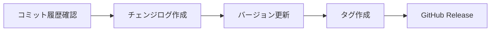

# Release Notes Skill

バージョンリリース時のチェンジログ生成と GitHub Release 作成の手順。

## リリースフロー



---

## 1. コミット履歴の確認

### 最新タグからの差分
// turbo
```powershell
git log $(git describe --tags --abbrev=0)..HEAD --oneline
```

### カテゴリ別分類
- `feat:` → ✨ New Features
- `fix:` → 🐛 Bug Fixes
- `docs:` → 📚 Documentation
- `refactor:` → ♻️ Refactoring
- `perf:` → ⚡ Performance
- `test:` → 🧪 Tests
- `chore:` → 🔧 Maintenance

---

## 2. チェンジログテンプレート

```markdown
# v<X.Y.Z> - YYYY-MM-DD

## ✨ New Features
- <feature description> (#<PR number>)

## 🐛 Bug Fixes
- <fix description> (#<PR number>)

## ♻️ Refactoring
- <refactor description>

## 📚 Documentation
- <docs update description>

## 🔧 Maintenance
- <maintenance description>
```

---

## 3. バージョン更新

### package.json (ルート)
```powershell
npm version patch  # or minor / major
```

### 各アプリの package.json
```powershell
pnpm --filter <app-name> version patch
```

---

## 4. Git タグ作成

```powershell
git tag -a v<X.Y.Z> -m "Release v<X.Y.Z>"
git push origin v<X.Y.Z>
```

---

## 5. GitHub Release (MCP経由)

### 最新リリース確認
// turbo
```
mcp_github-mcp-server_get_latest_release(owner="dcrown99", repo="code")
```

### リリース作成 (GitHub UIで実施推奨)
1. GitHub → Releases → New Release
2. タグ選択: `v<X.Y.Z>`
3. タイトル: `v<X.Y.Z> - <Release Name>`
4. 本文: チェンジログをペースト
5. Publish Release

---

## ADR 更新

重要な変更がある場合は `ADR.md` も更新すること。

```markdown
## ADR-0XX: <Title>
- **Date:** YYYY-MM-DD
- **Status:** Accepted
- **Decision:** <決定内容>
- **Rationale:** <理由>
```
