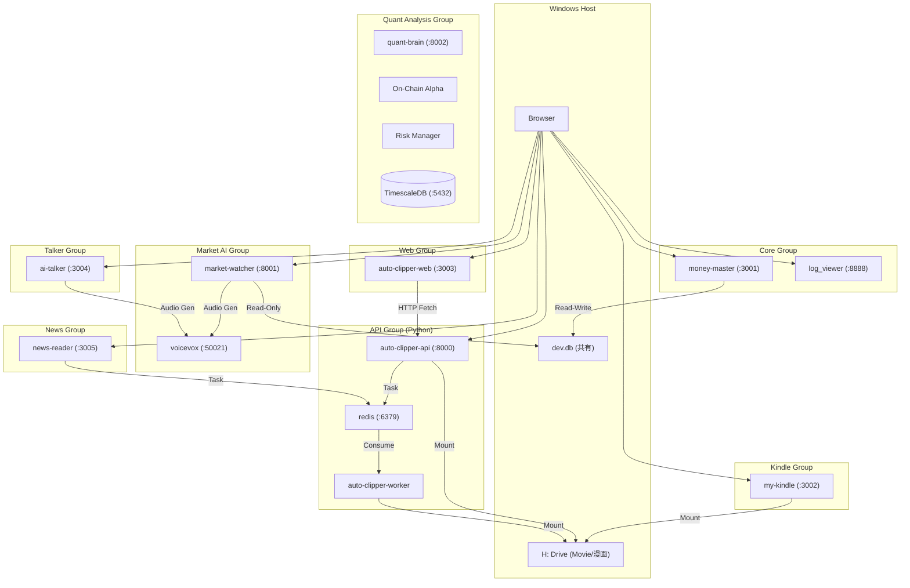

# 🏗️ システムアーキテクチャ (Antigravity Ultimate Edition)

## 📊 概要
本システムは、**分離されたDocker Compose構成** (`base` + `dev`/`prod`) によって管理される13個のコンテナを持つ **分散Dockerアーキテクチャ** で動作します。

> **Note:** `auto-clipper-worker` はポート公開なしのバックグラウンドワーカーです。
すべてのサービスは **`app-network`** (Bridge) に接続され、コンテナ名による相互通信が可能です。
すべてのNext.jsアプリケーションは **マルチステージビルド** を採用し、高速なデプロイと軽量なイメージを実現しています。
また、**Polyglot Monorepo** として、Pythonサービス (`auto-clipper-api`, `market-watcher`, `quant-brain`) も TurboRepo パイプラインに統合されており、`pnpm lint` や `pnpm test` で一元管理されています。

```mermaid
graph TD
    subgraph Host ["Windows Host"]
        Browser
        SQLite["dev.db (共有)"]
        ExternalDrive["H: Drive (Movie/漫画)"]
    end

    subgraph Core_Group ["Core Group"]
        MM["money-master (:3001)"]
        Dozzle["log_viewer (:8888)"]
    end

    subgraph Kindle_Group ["Kindle Group"]
        Kindle["my-kindle (:3002)"]
    end

    subgraph Web_Group ["Web Group"]
        Web["auto-clipper-web (:3003)"]
    end

    subgraph Talker_Group ["Talker Group"]
        Talker["ai-talker (:3004)"]
    end

    subgraph API_Group ["API Group (Python)"]
        API["auto-clipper-api (:8000)"]
        Worker["auto-clipper-worker"]
        Redis["redis (:6379)"]
    end

    subgraph Market_Group ["Market AI Group"]
        Watcher["market-watcher (:8001)"]
        Voicevox["voicevox (:50021)"]
    end

    subgraph Quant_Group ["Quant Analysis Group"]
        QuantBrain["quant-brain (:8002)"]
        OnChain["On-Chain Alpha"]
        RiskMgr["Risk Manager"]
        TimescaleDB[("TimescaleDB (:5432)")]
    end

    subgraph News_Group ["News Group"]
        NewsReader["news-reader (:3005)"]
    end

    %% Connections
    Browser --> MM
    Browser --> Kindle
    Browser --> Web
    Browser --> Talker
    Browser --> NewsReader
    Browser --> API
    Browser --> Watcher
    Browser --> Dozzle

    Web -->|HTTP Fetch| API
    API -->|Task| Redis
    NewsReader -->|Task| Redis
    Redis -->|Consume| Worker
    
    Watcher -->|Read-Only| SQLite
    MM -->|Read-Write| SQLite
    Watcher -->|Audio Gen| Voicevox
    Talker -->|Audio Gen| Voicevox

    Kindle -->|Mount| ExternalDrive
    API -->|Mount| ExternalDrive
    Worker -->|Mount| ExternalDrive
```

## 🔌 ポートレジストリ (予約済み)

| ポート | サービス | タイプ | プロトコル |
|--------|----------|--------|------------|
| **3001** | money-master | App | HTTP |
| **3002** | my-kindle | App | HTTP |
| **3003** | auto-clipper-web | App | HTTP |
| **3004** | ai-talker | App | HTTP |
| **3005** | news-reader | App | HTTP |
| **8000** | auto-clipper-api | API | HTTP (FastAPI) |
| **8001** | market-watcher | API | HTTP (FastAPI) |
| **8002** | quant-brain | API | HTTP (FastAPI) |
| **8888** | dozzle | Tool | HTTP |
| **5432** | timescaledb | Infra | TCP (PostgreSQL) |
| **6379** | redis | Infra | TCP |
| **50021** | voicevox | AI | HTTP |

## 🛠️ 開発インフラ (DevOps)

### 1. コード品質 (Code Quality)
- **Linter (TS):** ESLint (`@repo/config/eslint.config.mjs`)
- **Linter (Python):** Ruff (`pyproject.toml`)
- **Format:** Prettier (TS/JSON/MD)
- **Pre-commit:** lint-staged + Husky

### 2. GitHub Actions (CI)
Pull Request作成時およびmainブランチへのプッシュ時に、以下のジョブが並列実行されます。
- **Lint:** 全プロジェクトの静的解析 (`pnpm turbo lint`)
- **Type Check:** TypeScriptの型定義チェック (`pnpm turbo type-check`)
- **Test:** ユニットテストと統合テスト (`pnpm turbo test`)
- **Build:** 本番ビルドの検証 (`pnpm turbo build`)
- **Docs Check:** ドキュメント整合性チェック (`python scripts/verify_docs.py`)

### 3. デプロイ (CD)
現在はローカルスクリプト (`scripts/redeploy_all.ps1`) による手動デプロイを採用しています。
将来的にGitHub Actionsからの自動デプロイへの拡張が可能です。
