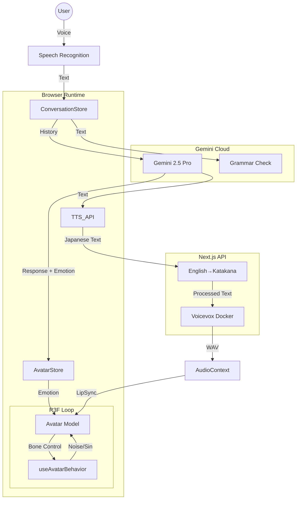

# 🌌 AI Talker: Project SUPERNOVA

> **Antigravity Ultimate Edition**
> Gemini 2.5 Pro × Cyber-HUD × Biological Animation

単なる英会話アプリではありません。
最新のLLM推論能力と、映画品質の3Dグラフィックスを融合させた、**「実在するAIパートナー」との対話シミュレーター**です。

## ✨ Key Features

### 🧠 Intelligent Core (The Brain)
- **Gemini 2.5 Pro:** 文脈を深く理解し、感情豊かな返答を生成。
- **Japanese-First Conversation:** Voicevox音声エンジンに最適化された日本語ベースの会話。英語フレーズはカタカナで自然に発音。
- **Dual-Thread Processing:**
    - **Main:** 即座に応答を返す会話スレッド。
    - **Analyst:** バックグラウンドで文法ミスを解析し、HUDに「Sensei's Note」として修正案を投影。
- **Emotion Engine:** 会話内容から感情（Joy, Sorrow, Anger等）を推論し、表情と照明色をリアルタイムに制御。

### 👁️ Biological Visuals (The Body)
- **Cinematic Rendering:** Bloom（発光）、Vignette、Film Grainによる映画的質感。
- **Alive Behavior:**
    - **Saccades:** 人間特有の「視線のゆらぎ」と「眼球跳躍運動」を再現。
    - **Gaze Avoidance:** 思考中や待機中にふと視線を外す、生物的な振る舞い。
    - **Breathing:** 胸部の微細な動きによる呼吸表現。
    - **Smart Lip-Sync:** 音声の強度に合わせた口パクと、発話時の表情ブレンディング最適化。
- **Kawaii Optimization:** アニメキャラクターを魅力的に見せるための女優ライト（Face Light）とリムライト設計。

### 🖥️ Cyber-HUD (The Interface)
- **Spatial UI:** 3D空間に浮かぶGlassmorphismデザインのチャットログ。
- **Dynamic Visualizer:** 音声入力の強度に合わせて有機的に波打つオーディオスペクトラム。
- **Cinematic Mode:** `H` キーで全UIを非表示にし、アバターとの対話に没入可能。
- **Boot Sequence:** アプリ起動時のサイバーパンク風アニメーション。

### 🎭 Avatar System
- **VRM/GLB Support:** VRMおよびGLBフォーマットのアバターに対応。
- **Custom Avatar Management:**
    - URLから直接VRMファイルを追加可能
    - ファイル名から自動的にアバター名を抽出
    - カスタムアバターの編集・削除機能
- **No Account Required:** Ready Player Meなどの外部サービスアカウント不要。

## 🛠️ Architecture



## 🚀 Quick Start

### Prerequisites
- Node.js 20+
- Docker Desktop (Windows with WSL2 or Linux/Mac)
- Google Gemini API Key

### Setup
```bash
# 1. Clone and navigate to project
cd apps/ai-talker

# 2. Start Voicevox container
docker-compose up -d voicevox

# 3. Install dependencies
pnpm install

# 4. Set environment variables
# Create .env.example with:
GEMINI_API_KEY=your_gemini_api_key
NEXT_PUBLIC_GEMINI_MODEL=gemini-2.5-pro
NEXT_PUBLIC_VOICEVOX_URL=http://voicevox:50021

# 5. Start development server
pnpm dev
```

### Access
- **Application:** http://localhost:3004
- **Port:** 3004 (mapped from container port 3000)

### Controls
- **Click Mic:** Start/Stop conversation.
- **H Key:** Toggle HUD (Cinematic Mode).
- **Settings Icon:** 
  - Change voice model (Voicevox presets)
  - Add custom VRM avatars via URL
  - Select tutor persona (優しい先生/鬼軍曹/友達)

## 🎨 Avatar Management

### Adding Custom Avatars

1. Click the **Settings** icon (⚙️)
2. In the **Avatar Model** section:
   - Enter an **Avatar Name** (or it will auto-extract from URL)
   - Paste a **VRM/GLB file URL**
   - Click **Add**

### Supported Formats
- `.vrm` (VRM 0.x / VRM 1.0)
- `.glb` (GLTF Binary)

### Example URLs
```
https://example.com/my-avatar.vrm
https://cdn.example.com/models/character.glb
```

## 📝 Tutor Personas

### 優しい先生 (Gentle Teacher)
- 日本語で優しく英語を教えます
- 間違いを丁寧に訂正
- 英語フレーズをカタカナで説明

### 鬼軍曹 (Drill Sergeant)
- 厳しい口調で英語を叩き込みます
- 大きな声ではっきり答えることを要求
- 感情: [angry] 多用

### 友達 (Casual Friend)
- タメ口でフランクに会話
- 文法より楽しさ優先
- 自然な日常会話で英語を学ぶ

## 🔧 Technical Highlights

### Voice Synthesis Optimization
- **English-to-Katakana Conversion:** サーバー側で英語テキストを自動的にカタカナに変換
  - アルファベット: A → エー、B → ビー
  - 単語: Hello → ハロー、Thank you → サンキュー
  - フレーズ: I got it → アイ ガット イット
- **Natural Japanese Speech:** Voicevoxの日本語音声エンジンで自然な発音を実現
- **Robust Voice Input:** Web Speech APIの「認識停止」問題を回避するため、`continuous: false` モードでの自動リスタートループを実装。

### Rendering Pipeline
- **Post-Processing:** SMAA、Bloom、Tone Mapping、Vignette、Noise
- **3-Point Lighting:** Key Light、Fill Light、Rim Light
- **Anime Aesthetic:** 発光効果とリムライトでキャラクターを際立たせる

### Dependencies
- `@google/generative-ai`: ^0.21.0 (System Instruction対応版)
- `@react-three/fiber`: 9.4.2
- `@react-three/drei`: 10.7.7
- `@react-three/postprocessing`: ^3.0.4 (React 19対応版)
- `@pixiv/three-vrm`: ^3.0.0
- `framer-motion`: ^11.0.0

## 🐛 Troubleshooting

### 音声が再生されない
- Voicevoxコンテナが起動しているか確認: `docker ps | grep voicevox`
- `docker-compose.base.yml`でvoicevoxが`app-network`に接続されているか確認
- **音声認識が反応しない:** ブラウザをリロードしてください。自動リスタートロジックが再初期化されます。

### アバターが表示されない
- ブラウザのコンソールでVRMファイルのロードエラーを確認
- VRMファイルのURLが正しいか確認
- CORS設定を確認（外部URLの場合）

### ビルドエラー
- `pnpm install`で依存関係を再インストール
- `docker restart ai-talker`でコンテナを再起動

## 📚 Related Documentation
- [SPECIFICATION.md](./SPECIFICATION.md) - 技術仕様の詳細
- [MANUAL.md](./MANUAL.md) - ユーザーマニュアル
- [docs/ADD_NEW_MODELS.md](./docs/ADD_NEW_MODELS.md) - アバター追加ガイド

## 🌟 Credits
- **Voicevox:** Japanese TTS engine
- **VRM Consortium:** 3D avatar standard
- **Google Gemini:** AI language model
- **Pixiv:** three-vrm library
