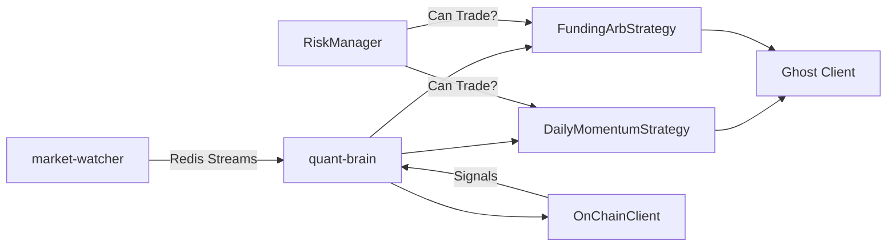

# Quant Brain 仕様書 (SPECIFICATION)

## 📋 概要

| 項目 | 詳細 |
|:---|:---|
| **サービス名** | Quant Brain (Neural Alpha Engine) |
| **ポート** | `8002` |
| **ランタイム** | Python 3.11 + FastAPI |
| **データソース** | Redis Streams, Bybit API, mempool.space, blockchain.com |

---

## 📡 データフロー



---

## 🧩 コンポーネント一覧

| コンポーネント | ファイル | 役割 | 帯域 |
|:---|:---|:---|:---:|
| **Neural Synapse** | `main.py` | メインエントリ、ライフサイクル管理 | - |
| **Daily Momentum** | `momentum_strategy.py` | RSI>50 + SMA200 (長期) 🆕 | 1/day |
| **Funding Arb** | `funding_arb.py` | 市場中立FR戦略 | 1/min |
| **On-Chain Alpha** | `onchain_client.py` | ネットワーク健全性監視 | 1/5min |
| **Risk Manager** | `risk_manager.py` | DD制限、ポジションサイジング | - |
| **Ghost Client** | `ghost_client.py` | ペーパートレード | - |

---

## 🚦 API エンドポイント

| Endpoint | Method | 説明 |
|:---|:---:|:---|
| `/status` | GET | システム稼働状況 |
| `/funding` | GET | Funding Rate戦略状況 |
| `/momentum` | GET | Daily Momentum戦略状況 🆕 |
| `/onchain` | GET | On-Chain指標 |
| `/risk` | GET | リスク管理状況 |
| `/ws/monitor` | WS | リアルタイムモニタリング |

---

## ⚙️ 設定パラメータ

| 環境変数 | デフォルト | 説明 |
|:---|:---:|:---|
| `REDIS_URL` | `redis://redis:6379/0` | Redis接続URL |
| `DATABASE_URL` | - | TimescaleDB接続URL |
| `DISCORD_WEBHOOK_URL` | - | Discord通知Webhook |
| `MAX_DRAWDOWN_PCT` | 10.0 | 最大ドローダウン(%) |
| `MAX_POSITION_PCT` | 20.0 | 最大ポジション(資産の%) |
| `KELLY_FRACTION` | 0.25 | Kelly Criterionの使用割合 |
| `ENTRY_THRESHOLD` | 15.0 | FR戦略エントリー閾値(年率%) |
| `EXIT_THRESHOLD` | 5.0 | FR戦略イグジット閾値(年率%) |
| `MOMENTUM_POSITION_USD` | 500.0 | Momentum戦略ポジションサイズ 🆕 |

---

## 📊 シグナル種別

| シグナル | トリガー | 意味 |
|:---|:---|:---|
| `funding_signal` | 年率10%超 | 高FR機会 |
| `funding_entry` | 年率15%超 | ポジションエントリー |
| `funding_exit` | 年率5%以下 | ポジションクローズ |
| `daily_momentum_entry` | RSI>50 & Price>SMA200 | 長期ロングエントリー 🆕 |
| `daily_momentum_exit` | RSI<50 or Price<SMA200 | 長期イグジット 🆕 |
| `high_fee` | 100 sat/vB超 | ネットワーク混雑 |
| `low_fee` | 5 sat/vB以下 | 静かな市場 |
| `mempool_congestion` | 20万TX超 | 大量送金発生 |

---

## 🛡️ リスク管理

### Max Drawdown
- 初期残高からの最大下落率を監視
- 10%超でトレード自動停止
- 手動リセット可能

### Position Sizing (Kelly Criterion)
```
Kelly% = W - [(1-W) / R]
- W = 勝率
- R = 平均利益 / 平均損失
```
安全のため Kelly の 25% (Fractional Kelly) を使用

---

## 📈 戦略根拠 (Evidence)

### DailyMomentumStrategy (独自検証済み ⭐ Low Overfit Risk)

| 指標 | 値 | 備考 |
|:---|:---|:---|
| **Total Return** | 1471.59% | 2017-2024 (7年) |
| **Sharpe Ratio** | 2.50 | Optuna最適化後 |
| **Max Drawdown** | 38.0% | Buy&Holdの83%対比半減 |
| **取引回数** | 105回 (約15回/年) | 1日1回評価 |
| **勝率** | 41.9% | リスク調整済み |

**最適化パラメータ:**
- RSI Period: 16
- RSI Threshold: 55
- SMA Period: 190

### FundingArbStrategy (独自最適化済み)

| 指標 | 値 | 備考 |
|:---|:---|:---|
| **Entry Threshold** | 5.0% (年率) | Optuna最適化後 |
| **Exit Threshold** | 3.0% (年率) | - |
| **Sharpe Ratio** | 4.88 | 15日データ |
| **Win Rate** | 100% | 28取引 |

> ⚠️ データ期間が15日間のため、長期検証が必要

---

*Last Updated: 2025-12-23*
*Momentum Backtest: Binance BTCUSDT Daily (2017-07-14 to 2024-12-22)*
*Funding Backtest: Bybit 15-day sample*

